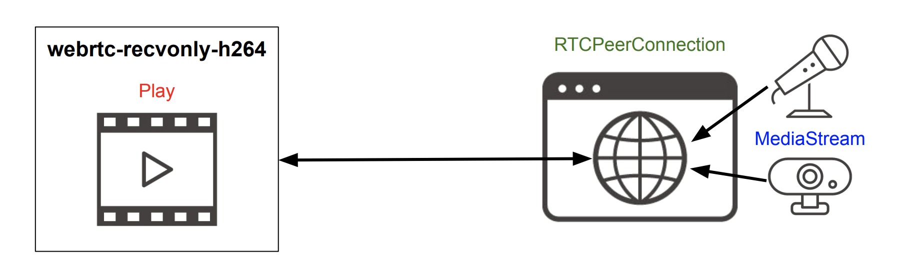
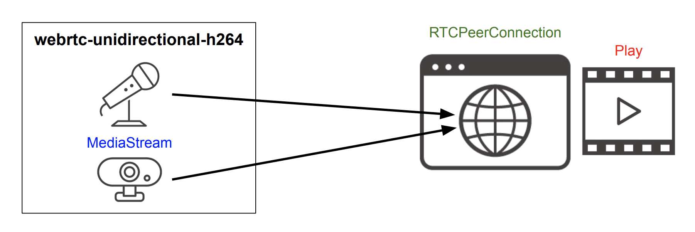
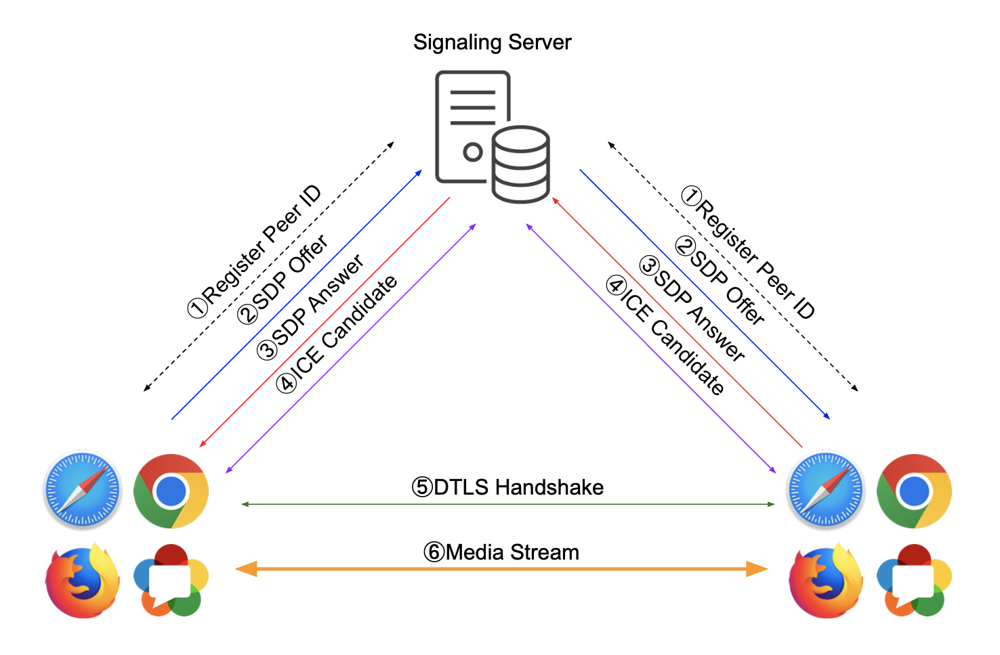

# GStreamerでWebRTCを簡単に試してみる

動作確認はMacで試しています

下記をインストール
```shell
brew install glib
brew install gstreamer
brew install libnice-gstreamer
brew install libsoup@2
```


### 受信のみ
* webrtc-recvonly-h264

```shell
$ ./webrtc-recvonly-h264
WebRTC page link: http://127.0.0.1:57778/
```

### 送信のみ
* webrtc-unidirectional-h264

送受信
```shell
$ ./webrtc-unidirectional-h264
WebRTC page link: http://127.0.0.1:57778/
```

### 送受信
* webrtc-sendrecv


上記のコードではWebとシグナリングサーバが1つになっていますが、  
このケースではWebとシグナリングサーバを立ち上げる必要があります  
```shell
$ make server
```

http://localhost/ を開くと現在のPeerIDが表示されます。  
これは、一時的な電話番号のようなものです。  
そのIDに対して実行します。  

```shell
$ ./webrtc-sendrecv --peer-id=9999
```

ブラウザを2つ立ち上げて、送受信できます

* 送受信Java版  
```shell
docker exec -it gst-java-sendrecv-1 java -jar app --peer-id=1111
```
